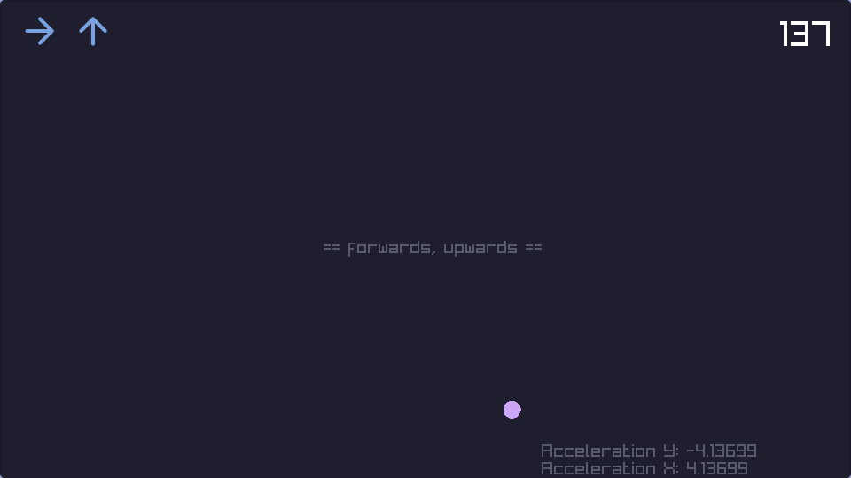

# About

This is my first ever real "game" in **C++** and **raylib**.



# Build

You can build this small game using **Meson** with these commands:

```bash
meson setup build
meson compile -C build
```
